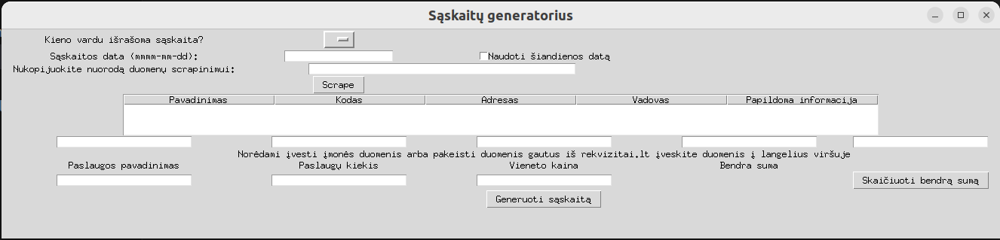

# Invoice generator project

This project is not only for practising Python, but also to make useful tool which generates invoices for me

# About

Collects information about invoice in GUI made with tkinter. Optionally scrapes company details from rekvizitai.vz.lt link, details could be updated if needed manually. Adds todays date for invoice automatically, generates totals and amounts in words automatically. 
Generates invoice on .doc template.

